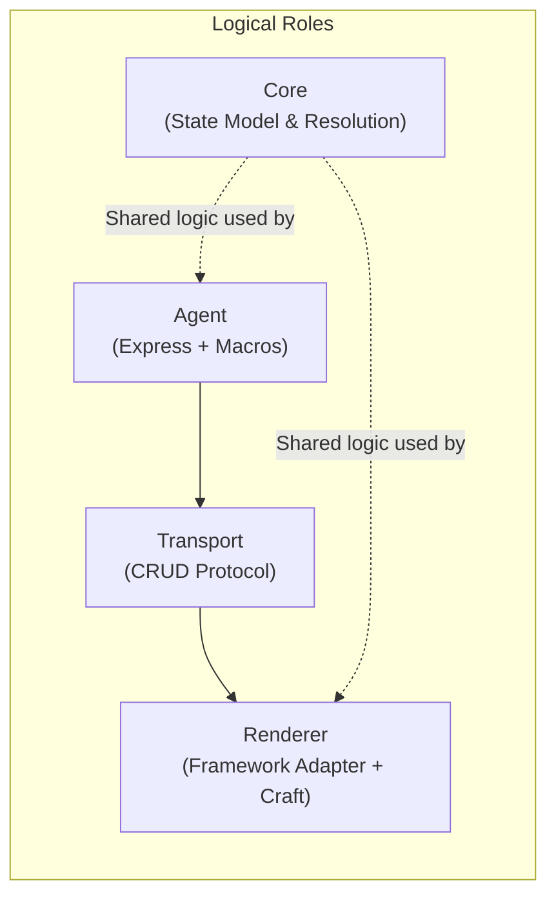
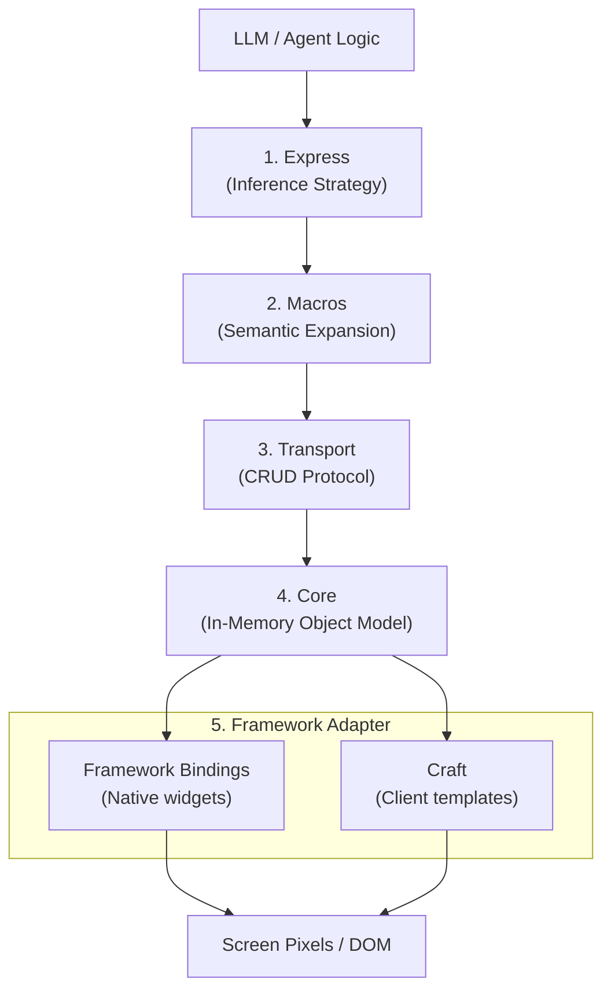
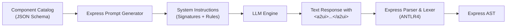
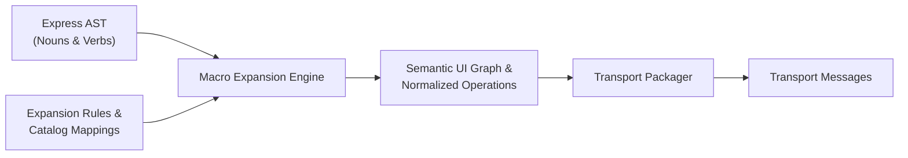
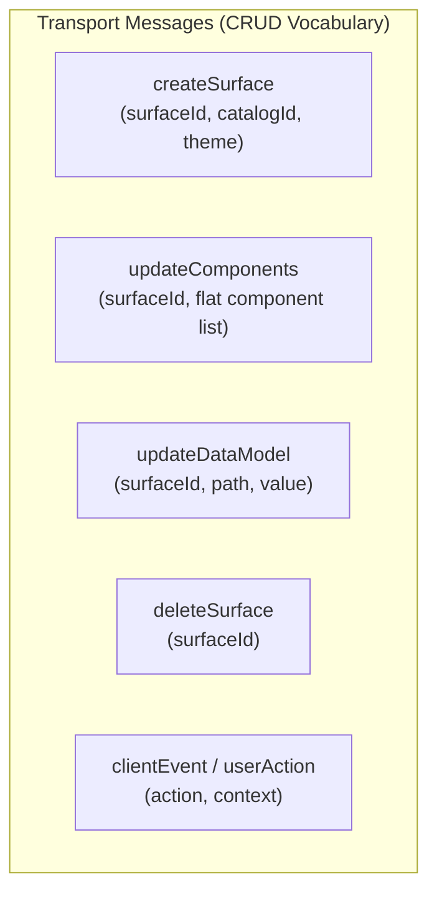
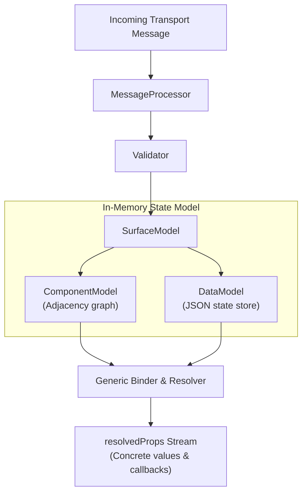
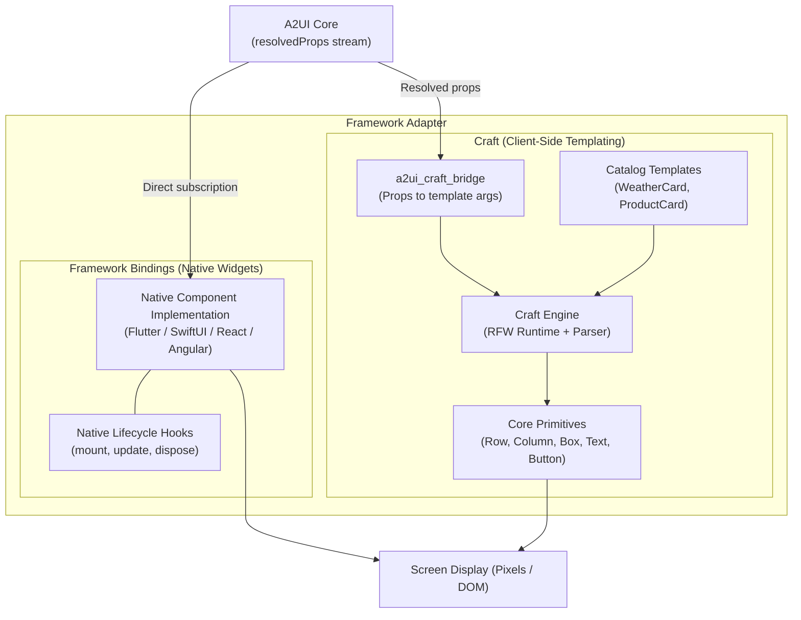
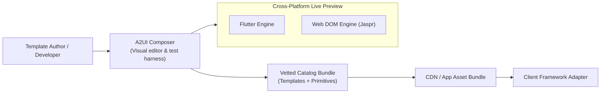

# A2UI target architecture

A2UI (Agent-to-User Interface) is a protocol and runtime architecture for generative user interfaces. It defines how autonomous agents and large language models (LLMs) compose, update, and interact with user interfaces across different client frameworks and runtimes.

This document describes the target architecture of A2UI.

---

## Logical and physical topology

A2UI separates logical architectural roles from physical deployment locations.



### Logical roles

The architecture defines two primary logical roles connected by a protocol:

* **Agent**: Generates and coordinates the interface. The agent hosts the model inference logic (Express) and semantic expansions (Macros).
* **Renderer**: Materializes and renders the interface to the user. The renderer hosts the view layer, including native framework bindings and client-side templates (Craft).
* **Core**: A shared library used by both the agent and the renderer. Core maintains the state model, validates schemas, and resolves data bindings without depending on UI frameworks, network protocols, or host environments.

### Physical topologies

Physical locations (client devices versus remote servers) can be arranged in several configurations depending on the runtime environment:

```mermaid
graph TD
    subgraph ServerToClient["1. Remote agent with client renderer (most common)"]
        direction LR
        S1["Server<br/>(Agent: LLM + Express + Macros)"] -->|Network: SSE / WebSocket / MCP<br/>(Transport messages)| C1["Client Device<br/>(Core + Framework Adapter / Craft)"]
    end

    subgraph OnDevice["2. On-device generative UI"]
        direction LR
        A2["On-Device LLM + Express + Macros"] -->|In-memory queue / IPC<br/>(Transport messages)| R2["Client UI Layer<br/>(Core + Framework Adapter / Craft)"]
    end

    subgraph ServerSide["3. Server-side rendering"]
        direction LR
        A3["Server Agent<br/>(LLM + Express + Macros)"] -->|Internal pipeline<br/>(Transport messages)| R3["Server UI Framework<br/>(Core + Server Adapter, e.g. Django/Node)"]
    end
```

1. **Remote agent with client renderer**: The agent runs on a server (such as a Python service using an LLM API), while the renderer runs on a client device (such as a Flutter, React, or iOS application). Transport messages travel over network connections like Server-Sent Events (SSE), WebSockets, or the Model Context Protocol (MCP).
2. **On-device generative UI**: Both the agent and the renderer execute locally on the client device. A local small language model drives Express, and transport messages pass through local memory or inter-process communication directly to the local view layer.
3. **Server-side rendering**: Both the agent and the renderer run on a server. The renderer produces HTML or headless snapshots before delivering rendered output to the client.

---

## Architectural layers

The end-to-end pipeline consists of five distinct layers:



| Layer | Primary role | Artifacts and outputs |
| :--- | :--- | :--- |
| **Express** | Inference strategy for LLM agents | Compact DSL text within `<a2ui>` tags |
| **Macros** | Expands syntax into semantic UI descriptions | Expanded semantic component tree and data operations |
| **Transport** | CRUD protocol carrying UI structure and state | JSON messages (`createSurface`, `updateComponents`, etc.) |
| **Core** | Transforms messages into reactive object model | Reactive models (`SurfaceModel`, `ComponentModel`, `DataModel`) |
| **Framework Adapter** | Paints object model to physical pixels | Native widgets (Flutter, SwiftUI, React) or Craft DOM/canvas |

Alongside this runtime pipeline, **A2UI Composer** serves as the developer environment for authoring, previewing, and testing cross-platform Craft templates before deployment.

---

## 1. Express

Express provides the inference strategy for language models. Models frequently produce malformed syntax and waste tokens when generating raw, deeply nested JSON structures. Express addresses this with a compact domain-specific language (DSL) combined with strict schema restrictions.



### Language grammar

The Express grammar is designed for low token counts and streaming compatibility:

* **Delimiters**: All UI blocks are enclosed in sentinel tags (`<a2ui>` and `</a2ui>`). Conversational text remains outside these tags.
* **Statements**: Every instruction is a variable assignment statement or surface command. Statements are separated by newlines.
* **Component nesting**: Components can be assigned to unique variable identifiers (such as `header = Text("Title")`) or nested inline as arguments (such as `Card(child=Text("Title"))`). A reserved variable named `root` serves as the entry point.
* **Signatures and arguments**: Supports positional arguments with `_` placeholders for omitted optional parameters, as well as explicit keyword arguments (`param=value`).
* **Primitives**: Literal strings (`"..."` and multiline `"""..."""`), raw strings (`r"..."` for regular expressions), numbers, booleans, and `null`.
* **Data binding**: Data model references use `$` prefixes. Absolute paths start with `$/` (such as `$/user/name`), while relative scopes omit the slash (such as `$item`).
* **Data population**: Assigning directly to absolute data paths (such as `$/user/age = 30`) populates the surface data model.
* **Validation and actions**: Client validation rules use `?` prefixes (such as `?required` or `?regex(...)`). Actions use the `Event("action_name", {context})` constructor.
* **Template iteration**: Dynamic list generation uses the `_template($/items, itemTemplate)` helper.
* **Surface lifecycle**: Direct commands such as `surface("id")` and `deleteSurface("id")`.

### Catalog schema

The catalog schema defines which components, properties, and functions the model can access:

* Component signatures are generated directly from catalog JSON schemas.
* Properties that require literal values are marked with `(static)` annotations, informing the model that dynamic bindings (`$/path`) are invalid for those parameters.
* Unused or unsupported components are pruned before prompt construction to preserve context space.

### Tooling and libraries

The Express layer includes the following supporting tools:

* **Prompt generators**: Compiles catalog definitions into compact plain-text signatures and instructions.
* **Parsers and lexers**: Tokenizes and parses output chunks using an ANTLR4 grammar.
* **Validators**: Verifies AST correctness, parameter counts, required actions, and data-binding constraints before processing.
* **Decompilers**: Converts standard transport payloads back into Express text to support few-shot examples or history continuation.

---

## 2. Macros

Macros provide a framework for expanding the concise nouns and verbs produced by Express into the semantic UI structures required by the transport layer.



### Purpose and expansion model

While Express optimizes for concise generation by the LLM, the downstream runtime requires canonical semantic definitions:

* **Noun expansion**: High-level or compound components emitted by the model are expanded into canonical semantic component graphs. A domain noun like `SearchHeader(...)` can expand into a layout containing a text field, icon, and cancel button.
* **Verb expansion**: High-level actions, iterative template helpers (`_template`), and shorthand lifecycle commands expand into explicit component relationships, context bindings, and data mutations.
* **Separation of concerns**: Models do not need to memorize low-level wiring or repetitive UI boilerplate. The macro layer performs normalization deterministically outside the LLM context.

---

## 3. Transport

Transport is the wire protocol carrying semantic UI definitions and data updates between the agent and the renderer.



### CRUD vocabulary

Transport implements a complete CRUD model:

* **Create**: `createSurface` registers a new surface identifier, associates it with a catalog, and defines initial surface themes or metadata.
* **Update (Structure)**: `updateComponents` adds or modifies components on an existing surface.
* **Update (Data)**: `updateDataModel` updates or removes values at specific JSON pointer paths within the surface data store.
* **Delete**: `deleteSurface` removes a surface and tears down its associated state.
* **Client actions**: Client-to-agent messages carry user interactions (clicks, form submissions) with their resolved data scopes.

### Adjacency list and data separation

Transport structures payloads using two design rules:

1. **Adjacency lists instead of nested trees**: `updateComponents` delivers components as a flat array where each component has a stable `id` and references its children by ID. This allows incremental, targeted component updates without sending whole-tree diffs.
2. **Separation of structure and data**: UI hierarchy lives in `updateComponents`, while reactive application state lives in `updateDataModel`. Components reference state paths via JSON pointers (`/user/name`), keeping layout definitions decoupled from data changes.

---

## 4. Core

The Core SDK is a platform-agnostic, headless library that converts Transport messages into an in-memory reactive object model.



### State containers and message processing

Core maintains long-lived state through dedicated containers:

* **`MessageProcessor`**: Coordinates message ingestion, executes structural schema validation, and routes updates to appropriate surface models.
* **`SurfaceModel`**: Tracks the lifecycle, catalog references, and active component registry for a single surface.
* **`ComponentModel`**: Stores raw properties, child references, and validation rules for a single component node.
* **`DataModel`**: Maintains the JSON document representing surface state, evaluated using RFC 6901 JSON pointers.

### Property resolution and reactivity

Core eliminates manual subscription management for UI renderers:

* **Resolution**: Replaces dynamic binding paths (`/path/to/value`) and client functions with concrete scalar values.
* **Scoped evaluation**: Provides nested data contexts (`DataContext.nested`) for repeated list items, ensuring relative paths resolve against their specific parent item index.
* **Reactivity stream**: Exposes component state as a stream of `resolvedProps`. When values in `DataModel` change, Core recomputes properties and notifies only the affected components.
* **Action handling**: Binds component action properties to dispatch callbacks that bundle the current scoped data context.

---

## 5. Framework adapter

The Framework Adapter connects Core's reactive object model to a target UI framework to paint screen pixels. It supports two implementation mechanisms: **Framework Bindings** and **Craft**.



### Framework bindings

Framework bindings expose hand-written, native framework components directly to the Transport catalog:

* Each catalog entry corresponds to a native widget or view class (such as a Flutter `Widget`, a React component, or a SwiftUI `View`).
* The native component subscribes directly to Core's `resolvedProps` stream and updates its local widget state.
* The component manages its own lifecycle, attaching listeners during mount and releasing them during disposal.
* Framework bindings are suited for design system libraries, platform-specific controls, and performance-critical base widgets.

### Craft templating system

Craft is a framework-agnostic, client-side templating engine. It lets developers build catalog widgets out of declarative templates rather than writing native code for every target framework.

* **Solves catalog multiplication**: Without templates, authoring $N$ catalog widgets across $M$ frameworks requires $N \times M$ native implementations. With Craft, each catalog widget is authored once as a template and rendered across supported frameworks (such as Flutter and Jaspr for web DOM).
* **Templates over primitives**: Craft separates high-level catalog widgets from low-level primitives:
  * *Primitives* are low-level building blocks (`Text`, `Row`, `Column`, `Box`, `Button`, `Image`). These are implemented natively once per framework adapter and remain private to the template engine.
  * *Templates* compose primitives into high-level catalog widgets (`WeatherCard`, `AccountSummary`).
* **Deployable as data**: Templates can be bundled and distributed as data over a network or CDN. A catalog can be updated or loaded on the fly without recompiling the host application binary.
* **Keyed reconciliation**: Craft maps each A2UI component to an adapter node keyed by the A2UI component ID. When incremental updates arrive, the framework updates only the affected node without re-evaluating the entire tree.

### Coexistence in a unified catalog

Framework bindings and Craft templates are complementary and coexist within the target architecture:

* An application catalog can contain both native framework bindings and Craft templates simultaneously.
* Standard system controls and complex inputs can be implemented through native Framework Bindings.
* Domain-specific views, brand cards, and dynamically distributed components can be authored as Craft templates.
* A2UI Core remains unaware of how a component is rendered; it resolves properties and passes them to whichever adapter implements the catalog entry.

---

## Tooling: A2UI Composer

A2UI Composer is a developer tool for authoring, previewing, and testing cross-platform Craft templates.



### Role and capabilities

In the target architecture, A2UI Composer focuses on the authoring and testing lifecycle of Craft templates:

* **Interactive template authoring**: Developers compose declarative Craft templates using the core primitive set (`Row`, `Column`, `Box`, `Text`, `Button`, `Image`).
* **Cross-platform verification**: Previews the template side by side across multiple rendering engines (such as Flutter and Jaspr for web DOM) to verify geometric parity and visual consistency across platforms.
* **State and mock data simulation**: Binds sample data models to test data paths, nested list iteration, and input behaviors without requiring an active agent backend.
* **Event and interaction debugging**: Simulates user interactions and logs emitted action events to confirm that action handlers and scoped arguments trigger as expected.
* **Catalog bundling**: Packages vetted templates into ephemerally loadable project bundles ready for CDN deployment or direct host integration.
